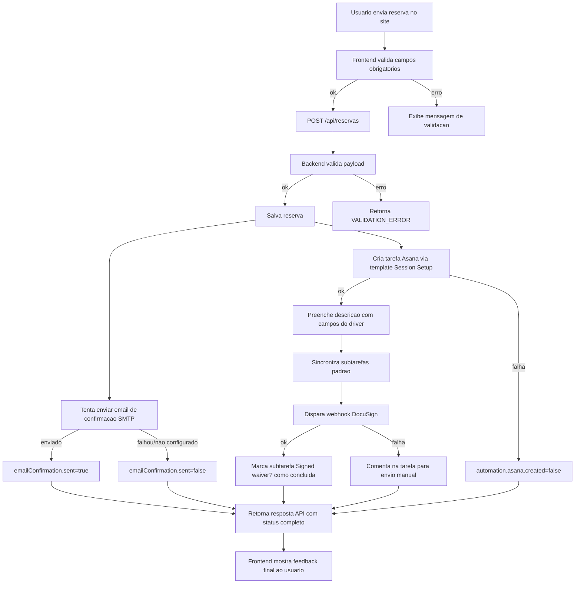

# Workflow: Reserva -> Email -> Asana -> DocuSign

Este fluxo representa o que acontece hoje quando o usuario clica em `Enviar reserva`.

Arquivo Draw.io editavel: `docs/workflows/reservation-automation-workflow.drawio`.

## Visao Geral

## Campos que alimentam a descricao do Asana

- Service Dates for this Month: data + periodo da reserva
- Age: age
- Height: height
- Weight: weight
- Waist: waist
- Responsible: responsavelPiloto
- Email: email
- Phone: telefone
- Karting Experience: kartingExperience (Sim/Nao)

## Subtarefas automatizadas

- Enviado Security Deposit?
- Signed waiver?
- Pago Security Deposit/Driver pass?
- Comprar Driver Pass?
- Enviar Driver Pass para o cliente
- Service Order
- Feedback about the driver/session
- Payment has been completed (invoice)?

## Resultado que voce deve observar na resposta da API

A chamada `POST /api/reservas` retorna:

- reserva
- emailConfirmation
- automation.asana
- automation.docusign
- automation.checklist

## Leitura rapida de status

- `emailConfirmation.sent=true`: email enviado
- `automation.asana.created=true`: tarefa criada no Asana
- `automation.docusign.triggered=true`: webhook DocuSign executado
- `automation.checklist.synced=true`: checklist de subtarefas sincronizado

## Onde isso esta no codigo

- Backend principal: `server.js`
- Frontend envio de reserva: `public/Calendar.html`
- Pipeline de feedback no cliente: `public/js/reservation/actions/submit-actions.js`
